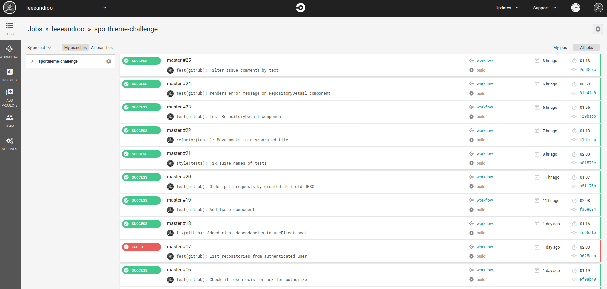
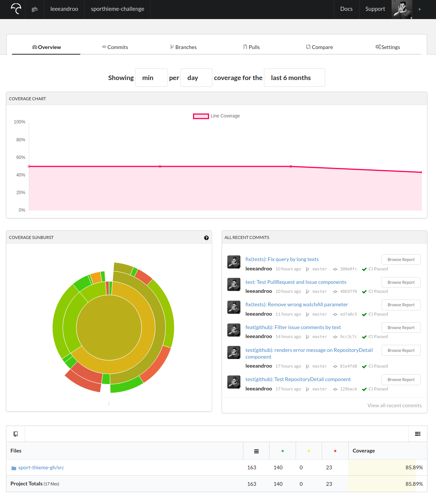

# Sport-Thieme Challenge

 

## About the challenge

It is a challenge for a Frontend Developer role on Sport-Thieme.

[See more here](CHALLENGE.md).

> **NOTE 1:** This project intentionally has less testing coverage than ideal as it is just a quick example.

> **NOTE 2:** Some improvements can easily be identified, like a pagination of items (repositories, issues, pull requests, comments, etc) and a more efficient search algorithm.

### Authorization

I have created an new GitHub app to allow user to access the data from GitHub.
The OAuth proccess on GitHub to exchange the **code** for an **access token** need to be done by backend, because of a CORS issue on the authenticate endpoint. To make it work properly I have created an middleware between this frontend application and GitHub OAuth API using the [gatekeeper](https://github.com/prose/gatekeeper) project and it was deployed to [heroku](https://sp-th-gatekeeper.herokuapp.com/).

You can override the GitHub app configuration using the environment variables (`.env` file) below:

| GitHub           | Env                               | Default value                                       |
| ---------------- | --------------------------------- | --------------------------------------------------- |
| Client ID        | REACT_APP_GH_CLIENT_ID            | 5af877cb1c5cb1ac7de4                                |
| Client Secret    | REACT_APP_GH_CLIENT_SECRET        | f5946977bf2ff32f6a345e697b92bab3e6c3e719            |
| Redirect URI     | REACT_APP_GH_REDIRECT_URI         | http://localhost:3000/                              |
| Authenticate URI | REACT_APP_GH_AUTH_API_URI         | https://github.com/login/oauth/authorize            |
| Access Token URI | REACT_APP_GH_ACCESS_TOKEN_API_URI | https://sp-th-gatekeeper.herokuapp.com/authenticate |

### How to run

- Clone this repository:

  `git clone https://github.com/leeeandroo/sporthieme-challenge.git`

- Install packages:

  `npm install`

- Start project:

  `npm start`

### Tests

- Run tests and watch:

  `npm test`

- Check the test coverage:

  `npm run test:coverage`

- Run cypress end to end tests:

  `npm run test:e2e`

- Validate code (format, lint, tests and build):

  `npm run validate`

### CircleCI and Codecov

I have configured circleCI to make the build and validate when new code is pushed to master branch.

Also, on build we generate the test coverage from the project and send to codecov tool.

